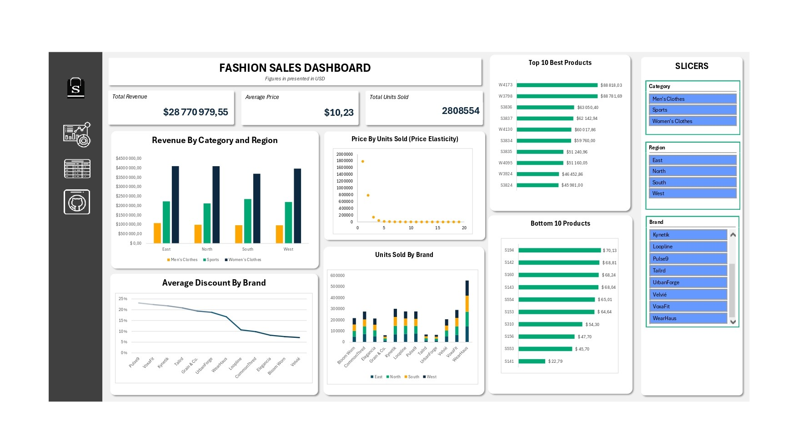

# FASHION SALES ANALYSIS || EXCEL

### PROJECT OVERVIEW

---

This project involved analyzing sales data for a fictional clothing company to uncover business insights and improve decision-making. Using **Excel and Power Query**, I performed data cleaning, transformation, exploratory data analysis (EDA), and dashboard design. The goal was to extract meaningful insights about product performance, pricing, brand behavior, and customer trends across different regions.

### OBJECTIVE

---

- Clean and prepare raw sales data using Excel and Power Query.
- Analyze sales performance across brands, product categories, and regions.
- Identify trends in pricing, discounts, and product demand.
- Use EDA to develop business insights and recommendations.
- Build an Excel dashboard to visualize KPIs and key findings.

### ABOUT THE DATA

---

I combined three separate datasets sourced from Kaggle, each representing fashion sales across men’s, women’s, and sports categories. The datasets were merged based on common attributes, with additional columns added to enhance analysis and support segmentation across categories and regions.

### CHAPTER 1: DATA CLEANING AND WRANGLING

---

Each dataset was cleaned individually using **Excel and Power Query**, before being consolidated into a master file. I documented the process in a summary report for each dataset, highlighting:

- The initial structure and issues in the raw data
- Cleaning steps (e.g., handling missing values, formatting, renaming columns)
- Before-and-after snapshots of the data
- A summarized view of the cleaned dataset for easy reference

I also used Power Query functions to automate formatting, filter logic, and transformation rules, allowing for a more dynamic and flexible data model.

### CHAPTER 2: EXPLORATORY DATA ANALYSIS (EDA)

---

After familiarizing myself with the data, I defined key business questions to guide the analysis. I then used pivot tables, charts, and summary statistics in Excel to explore:

- Revenue, price, units sold, and discount patterns
- Performance across regions, brands, and product types
- Trends that pointed to actionable insights beyond surface-level stats

The following questions shaped the analysis:

1. Which product categories generate the most revenue across regions?
2. Which brands are selling the most units in each region?
3. Are certain brands relying heavily on discounts?
4. Are certain product types consistently priced higher than others?
5. What are the top revenue-generating products overall?

### CHAPTER 3: KEY INSIGHTS

---

1. Price Elasticity
    - Sales volume dropped 56% between the <$10 and $10–$20 range, and an 82% from $10–$20 to $20–$30, despite only moderate price increases.
    - **Exception:** Dresses generated high revenue despite higher price, suggesting inelastic demand driven by factors like fashion appeal, branding, or cultural preferences.
2. Product Categories
    - The women’s category drove the most revenue across all regions due to its wider variety of product types
    - In contrast, men’s clothing had fewer products, limiting its revenue potential.
3. Discounts
    - Brands with heavy discounting (e.g., Pulse9) didn’t rank high in revenue.
    - This suggests that deep discounts aren’t translating into sales, possibly due to limited to brand loyalty or oversaturation.
4. Brands
    - Brands with diverse offerings across categories (e.g., WearHaus) perform better than niche-focused ones.
    - These brands benefit from broader market reach and more consistent sales across regions.

### CHAPTER 4: RECOMMENDATIONS

---

- **Men-focused brands** should reconsider large discount strategies. Targeted promotions or product bundles may yield better results.
- Double down on **Sports category promotions** during peak seasons, where discount-driven campaigns have shown success.
- **Pulse9** should test more strategic discounting, perhaps only on off-season items, as current strategies are not increasing revenue.
- **Velvié** may benefit from premium pricing strategies on high-demand items like dresses, especially in the **East region**, where customers already tolerate higher prices.
- Velvié could also study **Loopline’s** successful dress strategy — examining factors like marketing, design, or regional focus — and apply similar tactics.

### CHAPTER 5: DASHBOARD

---

To bring the analysis together, I created an interactive Excel dashboard summarizing key business metrics with dynamic filters. This dashboard allows users to explore patterns and insights across categories, brands, and regions.

### CHAPTER 6: REFLECTIONS

---

This project helped me to solidify best practices for structured data cleaning and analysis using Excel. Key takeaways include:

- How to apply **Power Query** for efficient and scalable wrangling
- Building **dynamic models** with named ranges and pivot structures
- Learning that EDA is not about numbers; it’s about finding the story behind the trands
- Developing business-driven insights from real-world questions

### SUMMARY

---

This project explored fashion sales across men’s, women’s, and sports categories using Excel Power Query. I identified key insights around pricing behavior, product demand, and brand performance. Even without a dashboard, this analysis demonstrated my ability to clean, model, and interpret data deliver strategic recommendations and support business decisions.
